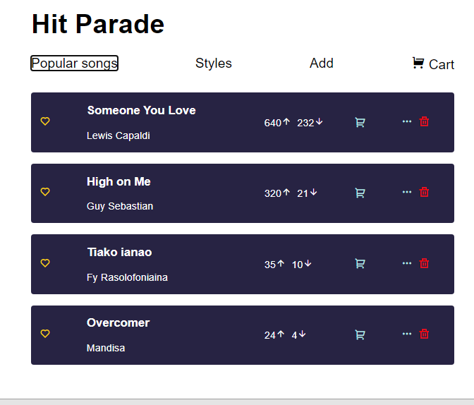

# Hit Parade in React

 Challenge: create a hit parade. We don't have an API to fetch but you need to create it on your own.

-   User story: I should already see songs rendering in the list by default.
-   User story: In the homepage I should see that list of songs. Path `"/"`
-   User story: When I click the style link at the top of the top of the design I should see a list of style that I can choose. Path `"/styles"`
-   User story: When I click on one style that should bring to a page that have a list of songs that contain style. Path `"/styles/:styleName"`
-   User story: I should be able to add a new song.
-   User story: I should see the list of song that has been cart.
-   User story: I should be able to update upvote and downvote.
-   User story: I should be able to change the list item into cart and I should be able to remove it from cart.
-   User story: I should be able to see the lyrics of the song when I click the three dots.
-   User story: i can favourite any song I want.
-   User story: When I add more song in the cart I should see the total price for them.
-   User story: I should be able to buy all the song. This is the process for that. At first I the `textContent` of the button should be `Buy`. When I click it, the textContent should change into `In process`. After two second or anytime you like, the textContent should be back to the what it was before and the list should be empty.
-   User story: If all of that is done and you are satisfied of what you have done. Try to save it in the local storage.

 ### Instructions : 
Code this hit parade with react, react-router and context!
Set up your own repo and project structure from scratch. 
Each screen here represents a route. Take some time to decide how the data structure of a song will look like. 

 ### Routes  : 

- / : Hit parade route, where you’re showing a list of songs, sorted by their popularity. You can inscrease or decrease the votes by clicking the icons. You can also favorite a song by clicking the heart icon. There is also a possibility to add a song to the cart. If you click on the three dots, you’ll be redirected to the song’s page, with the lyrics.

- /styles : It’s a page that shows the list of possible styles a song can have. Those styles of music are hardcoded, you don’t need to generate them dynamically.

- /styles/:styleName : it’s a page that lists all the songs from a specific style. If you click on a song, it will take you to the specific song page.

- /song/:songId : it’s a page that shows a specific song, and also the lyrics of a song

- /add : page with a form to add a song to the song catalog

- /cart: page where all the songs you added to your cart, appears. You can delete one from the list if you changed your mind. You can see the total of your cart value, and you can submit the order once you’re ready! (it should just show the complete price on the console)

You need to create your own songs for this project. Once your functionality is working, make the data persist in localStorage.

**Design**: https://www.figma.com/file/Nab1pgPVU2dciFofy4AOEe/Hit-Parade?node-id=0%3A1
**Icon** : https://remixicon.com/
Remember to add this in your HTML file: `<link href="https://cdn.jsdelivr.net/npm/remixicon@2.3.0/fonts/remixicon.css" rel="stylesheet">` to get access to the icon.
**Demo** : https://hit-parade-react-noeline.netlify.app/

 ## Get started:

- Create a new repo
- `npm init` to install package
- `npm install react react-dom` to install react.
- `npm react-router-dom` to get access to the Link and the router.
- Run `parcel index.html` 
- Don't forget to add the browser list to avoid generatorruntime.
